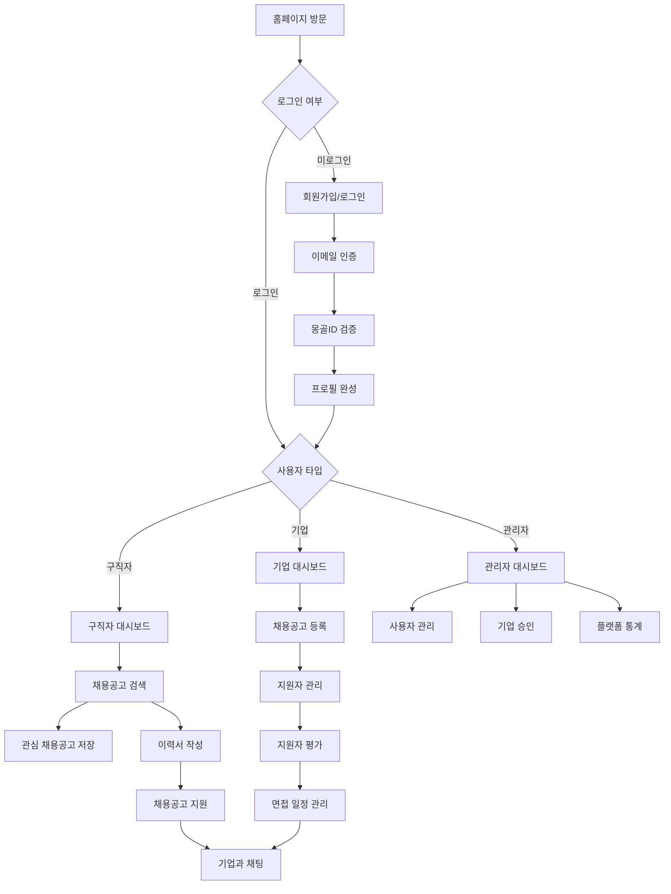
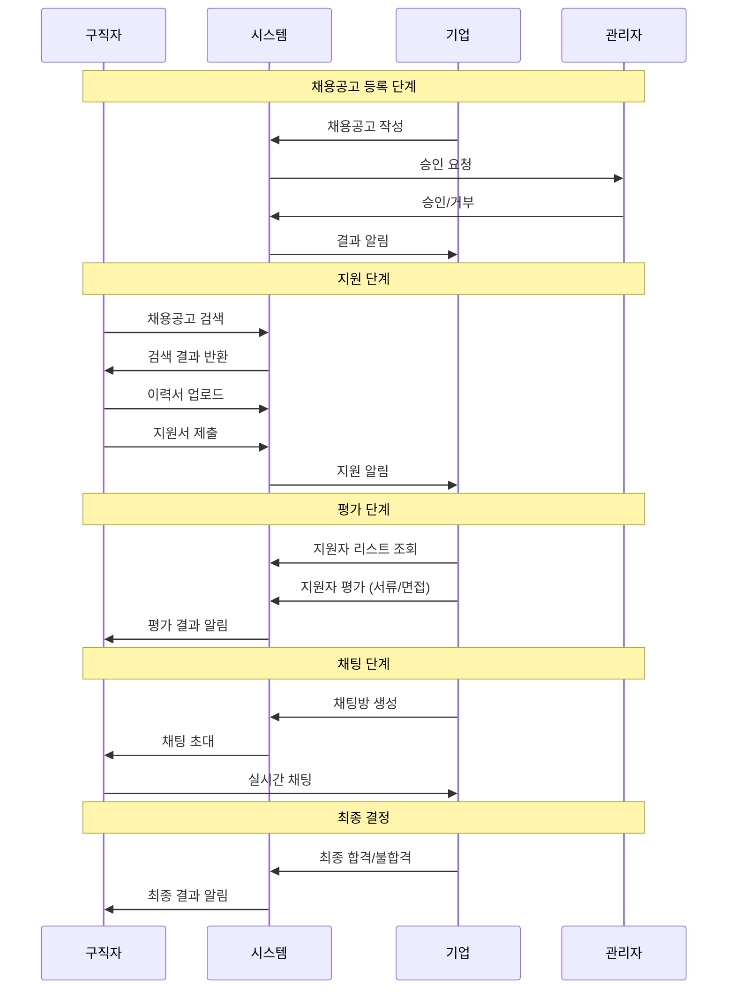
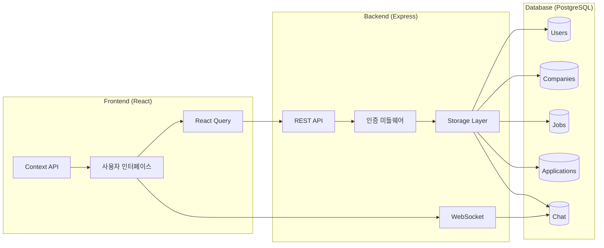
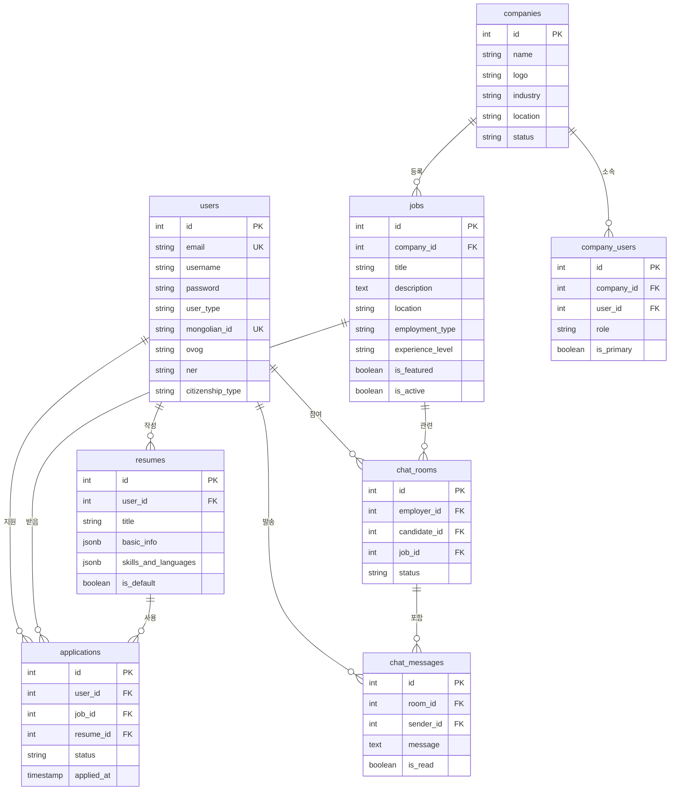

# 📋 SonGon (JobMongol) 채용 플랫폼 · 통합 개발자 지침서

> **Single Source of Truth** – 코드 변경 전·후 반드시 이 문서를 업데이트하십시오.  
> split view로 열어 두고, 기능·DB·플로우 변경 → 먼저 기록 → 커밋 순서를 지킵니다.

## 📝 Changelog

### 2025-01-19
- 핵심 비즈니스 플로우 다이어그램 추가 (사용자 여정, 채용 프로세스, 데이터 흐름도, ERD)
- 사용자 권한 매트릭스 및 화면 인벤토리 정리
- 구독 플랜, 고용/퇴사 연동, 채팅 규칙 등 비즈니스 로직 명세화
- 성능 최적화 전략 (키셋 페이지네이션, Redis 캐시, WebSocket 클러스터)
- 보안 수칙 강화 (JWT 15분 만료, Rate Limiting, S3 presigned URL)
- 일일 체크리스트 및 개발 워크플로우 체계화

### 2025-01-18
- 프로젝트 초기 문서화
- 데이터베이스 스키마 불일치 문제 해결
- 무한 로딩 이슈 수정 (schema.ts 동기화)

## 🎯 핵심 비전

- **몽골 1위 완전 반응형 구인구직 SaaS 플랫폼**
- **구독 기반 수익모델** (Job Seeker · Employer · Admin)
- **AI 추천, 실시간 채팅, 자동 고용/퇴사 연동** 등 혁신 기능 구현
- 모든 메뉴, 페이지, 기능들은 서로간의 연계를 항상 인지하면서 개발

## 🛠 기술 스택 (Technology Stack)

### Frontend
- **Framework**: React 18 + TypeScript
- **Build Tool**: Vite 5.4.14
- **Routing**: Wouter (경량 라우터)
- **State Management**: @tanstack/react-query (서버 상태)
- **UI 라이브러리**: 
  - Radix UI (접근성 중심 컴포넌트)
  - TailwindCSS 3.4.17 (스타일링)
  - shadcn/ui (컴포넌트 시스템)
  - Lucide React (아이콘)
  - Framer Motion (애니메이션)
- **Form 관리**: React Hook Form + Zod 검증
- **기타**: 
  - html2canvas + jsPDF (PDF 생성)
  - Recharts (차트 라이브러리)
  - date-fns (날짜 처리)

### Backend
- **Runtime**: Node.js + TypeScript
- **Framework**: Express.js 4.21.2
- **실시간 통신**: WebSocket (ws)
- **인증**: 
  - JWT (jsonwebtoken)
  - bcryptjs (패스워드 해싱)
  - Passport.js
- **세션 관리**: express-session + connect-pg-simple
- **캐싱**: node-cache + memoizee

### Database
- **DBMS**: PostgreSQL
- **ORM**: Drizzle ORM 0.39.1
- **마이그레이션**: Drizzle Kit
- **연결**: pg (PostgreSQL driver)

### Development Tools
- **TypeScript**: 5.6.3
- **Build**: esbuild (서버), Vite (클라이언트)
- **프로세스 관리**: concurrently
- **환경 설정**: dotenv + cross-env

### 외부 서비스 통합
- **결제**: Stripe
- **AI**: OpenAI + Anthropic SDK
- **데이터 생성**: @faker-js/faker

## 🏗 프로젝트 구조

```
JobMongol/
├── client/                 # 프론트엔드 (React + Vite)
│   ├── src/
│   │   ├── components/     # 재사용 가능한 컴포넌트
│   │   │   ├── ui/        # shadcn/ui 기반 컴포넌트
│   │   │   ├── auth/      # 인증 관련 컴포넌트
│   │   │   ├── jobs/      # 채용공고 관련 컴포넌트
│   │   │   ├── companies/ # 기업 관련 컴포넌트
│   │   │   ├── chat/      # 채팅 컴포넌트
│   │   │   ├── resume/    # 이력서 관련 컴포넌트
│   │   │   ├── layout/    # 레이아웃 컴포넌트
│   │   │   ├── mobile/    # 모바일 전용 컴포넌트
│   │   │   └── common/    # 공통 컴포넌트
│   │   ├── pages/         # 페이지 컴포넌트
│   │   │   ├── admin/     # 관리자 페이지
│   │   │   ├── company/   # 기업 대시보드
│   │   │   └── user/      # 사용자 페이지
│   │   ├── contexts/      # React Context
│   │   ├── hooks/         # 커스텀 훅
│   │   ├── i18n/          # 다국어 지원
│   │   ├── lib/           # 유틸리티 및 타입
│   │   └── utils/         # 헬퍼 함수
│   └── index.html
├── server/                # 백엔드 (Express + TypeScript)
│   ├── auth.ts           # 인증 시스템
│   ├── routes.ts         # API 라우트
│   ├── storage.ts        # 데이터 액세스 레이어
│   ├── db.ts             # 데이터베이스 설정
│   ├── middleware/       # 미들웨어
│   └── utils/            # 서버 유틸리티
├── shared/               # 공유 코드
│   ├── schema.ts         # 데이터베이스 스키마 (Drizzle)
│   └── types.ts          # 공유 타입 정의
├── migrations/           # 데이터베이스 마이그레이션
├── scripts/              # 개발/배포 스크립트
└── public/               # 정적 파일
```

## 🔄 핵심 비즈니스 플로우

### 사용자 여정 흐름도



### 채용 프로세스 플로우



### 데이터 흐름도



## 👥 사용자 유형 & 권한 매트릭스

| 구분 | /user | /company | /admin |
|------|-------|----------|--------|
| **구직자** | ✅ 전체 | ❌ | ❌ |
| **기업** | ✅ 제한 | ✅ 전체(권한별) | ❌ |
| **관리자** | ✅ 조회 | ✅ 운영 | ✅ 전체 |

### 역할별 세부 권한
- **기업 역할**: owner · manager · hr_lead · hr_staff
- **관리자 역할**: super_admin · admin · user_mgr · company_mgr · staff

## 📱 화면/메뉴 인벤토리

### 5.1 사용자 사이트 (/user)
- **Home** · **Jobs** · **Companies** · **Feed** 
- **Support** (공지/FAQ/요금제) · **Auth** · **Chat** (구직자)

### 5.2 기업 대시보드 (/company) 
- **Dashboard** · **Analytics** · **Job Posts** · **Applications** 
- **Staff** · **Talent Search** · **Pipeline** · **AI Match** 
- **Interviews** · **Chat** · **Company Info** · **Settings**

### 5.3 관리자 CMS (/admin)
- **Dashboard** · **Deep Analytics** · **Users** · **Companies** 
- **Banners** · **Products** · **Admins** · **Roles** 
- **Settlement** · **BI** · **System Settings**

## 💼 핵심 비즈니스 로직

### 6.1 구독 플랜
- **구직자**: Free · Plus · Pro
- **기업**: Starter · Pro · Premium → Admin › Products에서 CRUD

### 6.2 고용/퇴사 연동 (citizen_id 기반)
```
기업 ▶︎ '고용' → staff insert → seeker.status=employed
기업 ▶︎ '퇴사' (평가 필수) → link 해제
구직자·기업 어느 쪽이 먼저 입력해도 citizen_id 로 이후 자동 매칭
```

### 6.3 채팅 규칙
- **기업 → 구직자** 선 Initiate, 구직자 단독 시작 금지
- **'채팅 닫기'** → 상호 발신 차단, 기록 유지
- **재요청** → 상대 수락 시 재개

### 6.4 프로필·검증 배지
- **구직자**: 주민등록증 + 셀카 업로드 → verified=true → UI Blue Badge

## 🗃 데이터베이스 스키마

### 핵심 테이블
- **users** · **companies** · **jobs** · **applications** · **resumes** 
- **staff** · **chat_rooms** · **chat_messages** · **subscriptions**
- **company_users**: 기업-사용자 연결
- **saved_jobs**: 관심 채용공고

### 몽골 특화 필드
- **mongolian_id**: 몽골 ID (2자리 몽골어 + 8자리 숫자) UNIQUE
- **ovog, ner**: 몽골식 성명 (성·이름)
- **citizenship_type**: 시민권 타입 (mongolian/foreign)

### 데이터베이스 설계 규칙
- **네이밍**: snake_case 테이블, camelCase JSON
- **삭제**: 소프트 삭제(deleted_at) 사용
- **파티셔닝**: 대용량 테이블 월별 파티션(chat_messages, feed)
- **스키마 변경**: 모든 schema 변경 → Drizzle migration 작성 후 `npm run db:migrate`

### 데이터베이스 관계도



## 🔐 보안 수칙

### 인증 시스템
- **JWT Access**: 15분 만료 / **Refresh**: 7일 만료
- **비밀번호 변경 시**: 강제 토큰 회전
- **로그인 Rate limit**: 5req/min
- **역할 기반 접근 제어**: candidate/employer/admin

### 보안 설정
- **S3 호환 스토리지** + presigned URL
- **.env / 비밀키**: 절대 커밋 금지
- **CORS**: 설정된 도메인만 허용
- **데이터 검증**: Zod 스키마 검증
- **비밀번호**: bcrypt 해싱
- **SQL Injection 방지**: Drizzle ORM 사용

## 🌐 다국어 전략

### 지원 언어
- **mn · ko** (몽골어 · 한국어)

### 구현 규칙
- **모든 UI 문자열** → i18n key (hard code 금지)
- **새 페이지**: 기존 locale 파일 수정 금지, 키 추가 방식
- Context API 기반 언어 전환
- JSON 기반 번역 파일
- 동적 언어 로딩

## 📱 반응형 디자인

### 브레이크포인트
- **Mobile**: < 768px
- **Tablet**: 768px - 1024px
- **Desktop**: > 1024px

### 모바일 최적화
- 하단 네비게이션
- 터치 친화적 UI
- 모바일 전용 컴포넌트

## ⚡ 성능 & 스케일

### 데이터베이스 최적화
- **인덱스**: 각 FK + mongolian_id, created_at 인덱스
- **페이지네이션**: 키셋(page > id) 페이지네이션, LIMIT/OFFSET 지양
- **캐싱**: Redis 캐시: 홈 통계·피드
- **실시간**: WebSocket Cluster로 전환(폴링 백업)

## 🔄 개발 워크플로우 & 명령어

### 핵심 명령어
```bash
npm run dev        # FE+BE 동시 실행
npm run server     # 백엔드만
npm run client     # 프론트만
npm run build      # 프로덕션 빌드
npm run check      # TS 타입 검사
npm run db:migrate # 마이그레이션 실행
npm run seed:jobs 500 # 더미 채용 500개
```

### 일일 체크리스트
1. **git pull** → merge → 충돌 해결
2. **문서 Changelog** 상단에 한 줄 추가
3. **i18n 키** 추가 여부 확인, 키에 따른 각 언어파일에 해당 문구가 추가되었는지 확인
4. **npm run test** & e2e 통과
5. **DB migration** 적용 여부 확인

### 필수 규칙

#### 1. DB 스키마 관리
```bash
# 스키마 변경 후 반드시 실행
npm run db:migrate
```

#### 2. 타입 안정성
- 모든 API는 Zod 스키마로 검증
- TypeScript strict 모드 사용
- shared 폴더의 타입 정의 활용

#### 3. 컴포넌트 개발
- shadcn/ui 컴포넌트 우선 사용
- 재사용 가능한 컴포넌트 작성
- 접근성(a11y) 고려

#### 4. 상태 관리
- 서버 상태: React Query
- 클라이언트 상태: useState/useReducer
- 글로벌 상태: Context API

### 추가 개발 명령어
```bash
# 데이터베이스 관리
npm run db:studio      # Drizzle Studio 실행
npm run db:push        # 스키마 동기화

# 테스트
npm run test           # 단위 테스트
npm run test:e2e       # E2E 테스트
```

## 🚀 배포 가이드

### 환경 변수 설정
```env
NODE_ENV=production
DB_HOST=192.168.0.171
DB_PORT=5432
DB_NAME=jobmongolia
DB_USER=jobmongolia_user
DB_PASSWORD=JobMongolia2025R5
JWT_SECRET=your-production-secret
SESSION_SECRET=your-session-secret
```

### 프로덕션 최적화
- 코드 난독화 (Terser)
- 소스맵 비활성화
- console.log 제거
- 청크 분할 최적화

## ⚠️ 중요 개발 원칙

### 1. 기능 연계성
모든 메뉴 및 페이지, 기능들은 서로간의 연계를 항상 인지하면서 개발

### 2. DB 동기화
기능 수정, 개선이나 새로 개발할 때:
- 항상 DB, 테이블, 컬럼까지 고려
- DB 작업까지 완료
- Drizzle migration 즉시 실행

### 3. 다국어 고려
모든 개발 작업 시 다국어 지원을 염두에 두고 개발

### 4. UI/디자인 변경 금지
명시적인 요청이나 지시가 없는 한 UI 및 디자인 변경 금지

## 🔧 문제 해결 가이드

### 일반적인 이슈

#### 1. 데이터베이스 연결 실패
- IP 주소 확인: 192.168.0.171 → 203.23.49.100
- 포트 5432 접근 가능 여부 확인

#### 2. API 500 에러
- 데이터베이스 스키마와 코드 일치 확인
- 로그 확인 (`console.log` 추가)

#### 3. 프론트엔드 빌드 실패
- Node.js 버전 확인 (권장: 18+)
- `node_modules` 삭제 후 재설치

### 포트 관리
- **백엔드**: 5000 (고정)
- **프론트엔드**: 5173 (기본), 5174 (대체)
- **Drizzle Studio**: 기본 포트

## 📊 모니터링 및 로깅

### 로깅 시스템
- API 요청/응답 로깅
- 에러 추적
- 성능 모니터링

### 메트릭 수집
- 사용자 행동 추적
- API 성능 측정
- 에러율 모니터링

## 👥 팀 협업 규칙

1. **코드 리뷰**: 모든 PR은 리뷰 필수
2. **커밋 메시지**: 한국어로 명확하게 작성
3. **브랜치 전략**: feature → develop → main
4. **이슈 관리**: GitHub Issues 활용

---

## 🔗 관련 문서

- [DB 업데이트 가이드](./DB-UPDATE-GUIDE.md)
- [프로덕션 보안 가이드](./PRODUCTION-SECURITY.md)
- [API 문서](./API-DOCS.md) (작성 예정)

---

**Last Updated**: 2025-06-18
**Version**: 1.0.0 