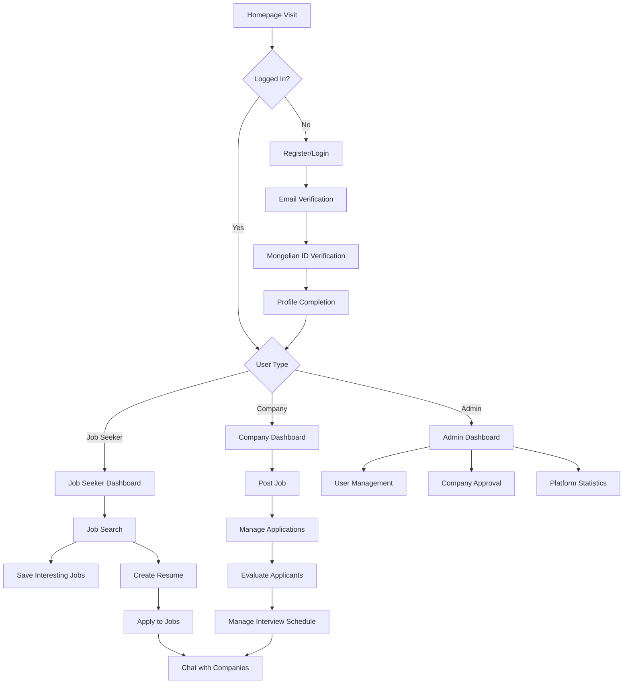
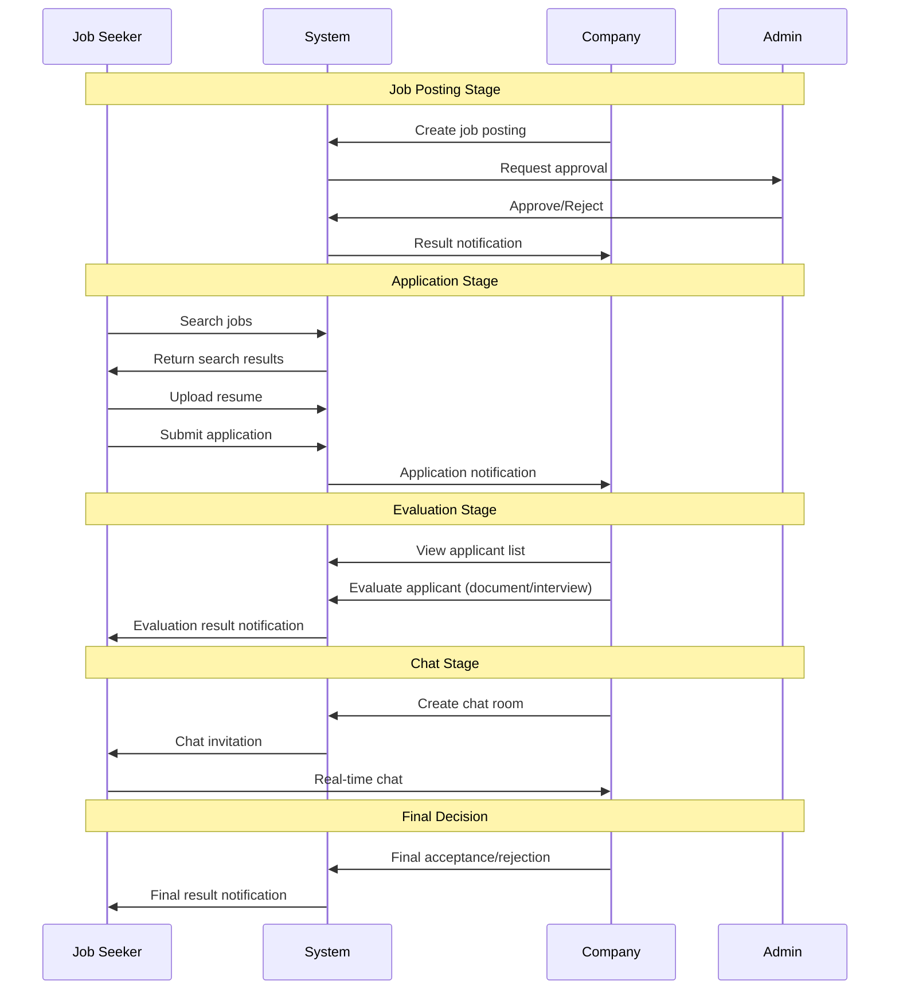
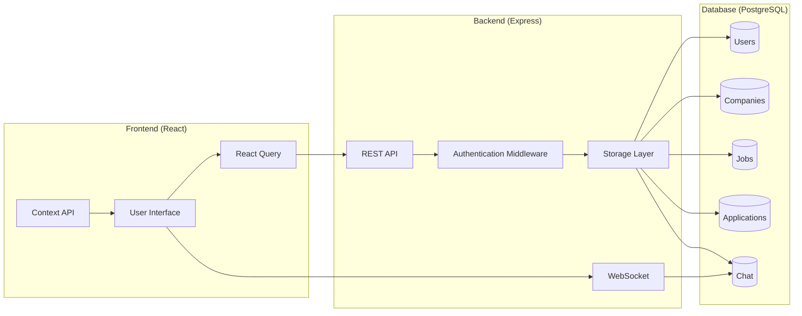
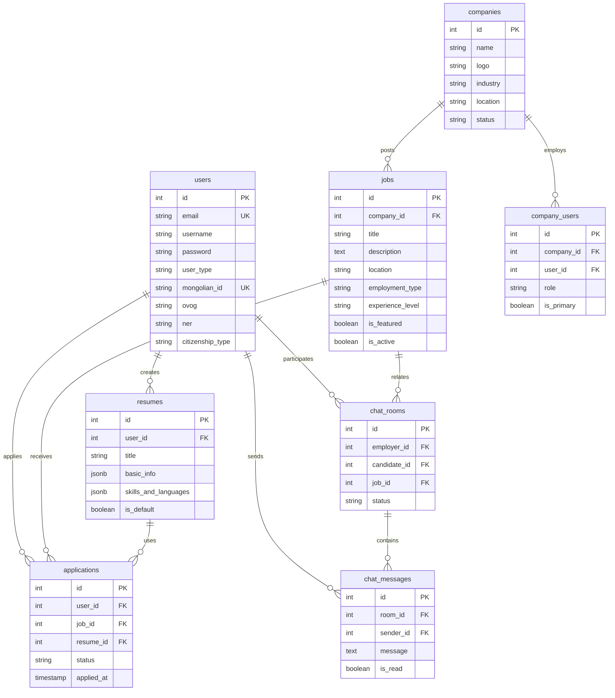

# SonGon (JobMongol) Recruitment Platform - Comprehensive Developer Guidelines

> **Single Source of Truth** – Always update this document before and after code changes.  
> Keep this open in split view, follow the order: feature/DB/flow changes → document first → commit.

## Changelog

### 2025-01-19
- Added core business flow diagrams (user journey, recruitment process, data flow, ERD)
- Organized user permission matrix and screen inventory
- Specified business logic including subscription plans, employment integration, chat rules
- Performance optimization strategies (keyset pagination, Redis cache, WebSocket cluster)
- Enhanced security measures (JWT 15-minute expiry, Rate Limiting, S3 presigned URL)
- Systematized daily checklist and development workflow

### 2025-01-18
- Initial project documentation
- Resolved database schema inconsistency issues
- Fixed infinite loading issue (schema.ts synchronization)

## Core Vision

- **Mongolia's Premier Fully Responsive Job Portal SaaS Platform**
- **Subscription-based Revenue Model** (Job Seeker · Employer · Admin)
- **Innovative Features**: AI recommendations, real-time chat, automated employment/termination integration
- All menus, pages, and features must be developed with constant awareness of their interconnections

## Technology Stack

### Frontend
- **Framework**: React 18 + TypeScript
- **Build Tool**: Vite 5.4.14
- **Routing**: Wouter (lightweight router)
- **State Management**: @tanstack/react-query (server state)
- **UI Library**: 
  - Radix UI (accessibility-focused components)
  - TailwindCSS 3.4.17 (styling)
  - shadcn/ui (component system)
  - Lucide React (icons)
  - Framer Motion (animations)
- **Form Management**: React Hook Form + Zod validation
- **Others**: 
  - html2canvas + jsPDF (PDF generation)
  - Recharts (chart library)
  - date-fns (date handling)

### Backend
- **Runtime**: Node.js + TypeScript
- **Framework**: Express.js 4.21.2
- **Real-time Communication**: WebSocket (ws)
- **Authentication**: 
  - JWT (jsonwebtoken)
  - bcryptjs (password hashing)
  - Passport.js
- **Session Management**: express-session + connect-pg-simple
- **Caching**: node-cache + memoizee

### Database
- **DBMS**: PostgreSQL
- **ORM**: Drizzle ORM 0.39.1
- **Migration**: Drizzle Kit
- **Connection**: pg (PostgreSQL driver)

### Development Tools
- **TypeScript**: 5.6.3
- **Build**: esbuild (server), Vite (client)
- **Process Management**: concurrently
- **Environment**: dotenv + cross-env

### External Service Integration
- **Payment**: Stripe
- **AI**: OpenAI + Anthropic SDK
- **Data Generation**: @faker-js/faker

## Project Structure

```
JobMongol/
├── client/                 # Frontend (React + Vite)
│   ├── src/
│   │   ├── components/     # Reusable components
│   │   │   ├── ui/        # shadcn/ui based components
│   │   │   ├── auth/      # Authentication components
│   │   │   ├── jobs/      # Job posting components
│   │   │   ├── companies/ # Company components
│   │   │   ├── chat/      # Chat components
│   │   │   ├── resume/    # Resume components
│   │   │   ├── layout/    # Layout components
│   │   │   ├── mobile/    # Mobile-specific components
│   │   │   └── common/    # Common components
│   │   ├── pages/         # Page components
│   │   │   ├── admin/     # Admin pages
│   │   │   ├── company/   # Company dashboard
│   │   │   └── user/      # User pages
│   │   ├── contexts/      # React Context
│   │   ├── hooks/         # Custom hooks
│   │   ├── i18n/          # Multi-language support
│   │   ├── lib/           # Utilities and types
│   │   └── utils/         # Helper functions
│   └── index.html
├── server/                # Backend (Express + TypeScript)
│   ├── auth.ts           # Authentication system
│   ├── routes.ts         # API routes
│   ├── storage.ts        # Data access layer
│   ├── db.ts             # Database configuration
│   ├── middleware/       # Middleware
│   └── utils/            # Server utilities
├── shared/               # Shared code
│   ├── schema.ts         # Database schema (Drizzle)
│   └── types.ts          # Shared type definitions
├── migrations/           # Database migrations
├── scripts/              # Development/deployment scripts
└── public/               # Static files
```

## Core Business Flows

### User Journey Flow



### Recruitment Process Flow



### Data Flow Diagram



## User Types & Permission Matrix

| Role | /user | /company | /admin |
|------|-------|----------|--------|
| **Job Seeker** | Full Access | None | None |
| **Company** | Limited | Full (by role) | None |
| **Admin** | View Only | Operations | Full Access |

### Detailed Permissions by Role
- **Company Roles**: owner · manager · hr_lead · hr_staff
- **Admin Roles**: super_admin · admin · user_mgr · company_mgr · staff

## Screen/Menu Inventory

### User Site (/user)
- **Home** · **Jobs** · **Companies** · **Feed** 
- **Support** (notices/FAQ/pricing) · **Auth** · **Chat** (job seekers)

### Company Dashboard (/company) 
- **Dashboard** · **Analytics** · **Job Posts** · **Applications** 
- **Staff** · **Talent Search** · **Pipeline** · **AI Match** 
- **Interviews** · **Chat** · **Company Info** · **Settings**

### Admin CMS (/admin)
- **Dashboard** · **Deep Analytics** · **Users** · **Companies** 
- **Banners** · **Products** · **Admins** · **Roles** 
- **Settlement** · **BI** · **System Settings**

## Core Business Logic

### Subscription Plans
- **Job Seekers**: Free · Plus · Pro
- **Companies**: Starter · Pro · Premium → Admin › Products for CRUD

### Employment/Termination Integration (citizen_id based)
```
Company ▶ 'Hire' → staff insert → seeker.status=employed
Company ▶ 'Terminate' (evaluation required) → unlink relationship
Either job seeker or company can input first, auto-matching via citizen_id later
```

### Chat Rules
- **Company → Job Seeker** must initiate first, job seekers cannot start independently
- **'Close Chat'** → mutual sending blocked, records preserved
- **Re-request** → resume upon counterpart acceptance

### Profile & Verification Badges
- **Job Seekers**: ID + selfie upload → verified=true → UI Blue Badge

## Database Schema

### Core Tables
- **users** · **companies** · **jobs** · **applications** · **resumes** 
- **staff** · **chat_rooms** · **chat_messages** · **subscriptions**
- **company_users**: company-user connection
- **saved_jobs**: saved job postings

### Mongolia-Specific Fields
- **mongolian_id**: Mongolian ID (2 Mongolian letters + 8 digits) UNIQUE
- **ovog, ner**: Mongolian name format (family name · given name)
- **citizenship_type**: citizenship type (mongolian/foreign)

### Database Design Rules
- **Naming**: snake_case tables, camelCase JSON
- **Deletion**: Use soft delete (deleted_at)
- **Partitioning**: Monthly partitions for large tables (chat_messages, feed)
- **Schema Changes**: All schema changes → create Drizzle migration → `npm run db:migrate`

### Database Relationship Diagram



## Security Guidelines

### Authentication System
- **JWT Access**: 15-minute expiry / **Refresh**: 7-day expiry
- **Password Change**: Force token rotation
- **Login Rate Limit**: 5req/min
- **Role-based Access Control**: candidate/employer/admin

### Security Configuration
- **S3 Compatible Storage** + presigned URL
- **.env / Secret Keys**: Never commit
- **CORS**: Allow only configured domains
- **Data Validation**: Zod schema validation
- **Password**: bcrypt hashing
- **SQL Injection Prevention**: Use Drizzle ORM

## Multi-language Strategy

### Supported Languages
- **mn · ko** (Mongolian · Korean)

### Implementation Rules
- **All UI Strings** → i18n key (no hard coding)
- **New Pages**: Don't modify existing locale files, add keys
- Context API-based language switching
- JSON-based translation files
- Dynamic language loading

## Responsive Design

### Breakpoints
- **Mobile**: < 768px
- **Tablet**: 768px - 1024px
- **Desktop**: > 1024px

### Mobile Optimization
- Bottom navigation
- Touch-friendly UI
- Mobile-specific components

## Performance & Scale

### Database Optimization
- **Indexes**: Each FK + mongolian_id, created_at indexes
- **Pagination**: Keyset (page > id) pagination, avoid LIMIT/OFFSET
- **Caching**: Redis cache: home statistics, feed
- **Real-time**: Transition to WebSocket Cluster (polling backup)

## Development Workflow & Commands

### Core Commands
```bash
npm run dev        # Run FE+BE simultaneously
npm run server     # Backend only
npm run client     # Frontend only
npm run build      # Production build
npm run check      # TS type checking
npm run db:migrate # Execute migration
npm run seed:jobs 500 # Generate 500 dummy jobs
```

### Daily Checklist
1. **git pull** → merge → resolve conflicts
2. **Document Changelog** add one line at top
3. **i18n keys** check if added, verify corresponding text added to each language file
4. **npm run test** & e2e pass
5. **DB migration** check if applied

### Essential Rules

#### 1. DB Schema Management
```bash
# Always run after schema changes
npm run db:migrate
```

#### 2. Type Safety
- All APIs validated with Zod schema
- Use TypeScript strict mode
- Utilize shared folder type definitions

#### 3. Component Development
- Prioritize shadcn/ui components
- Write reusable components
- Consider accessibility (a11y)

#### 4. State Management
- Server state: React Query
- Client state: useState/useReducer
- Global state: Context API

### Additional Development Commands
```bash
# Database management
npm run db:studio      # Run Drizzle Studio
npm run db:push        # Schema synchronization

# Testing
npm run test           # Unit tests
npm run test:e2e       # E2E tests
```

## Deployment Guide

### Environment Variables
```env
NODE_ENV=production
DB_HOST=192.168.0.171
DB_PORT=5432
DB_NAME=jobmongolia
DB_USER=jobmongolia_user
DB_PASSWORD=JobMongolia2025R5
JWT_SECRET=your-production-secret
SESSION_SECRET=your-session-secret
```

### Production Optimization
- Code obfuscation (Terser)
- Disable source maps
- Remove console.log
- Optimize chunk splitting

## Critical Development Principles

### 1. Feature Interconnectivity
All menus, pages, and features must be developed with constant awareness of their interconnections

### 2. DB Synchronization
When modifying, improving, or developing new features:
- Always consider DB, tables, columns
- Complete DB work
- Execute Drizzle migration immediately

### 3. Multi-language Consideration
Consider multi-language support in all development work

### 4. No UI/Design Changes
No UI or design changes unless explicitly requested or instructed

## Troubleshooting Guide

### Common Issues

#### 1. Database Connection Failure
- Check IP address: 192.168.0.171 → 203.23.49.100
- Verify port 5432 accessibility

#### 2. API 500 Errors
- Verify database schema and code alignment
- Check logs (add `console.log`)

#### 3. Frontend Build Failure
- Check Node.js version (recommended: 18+)
- Delete `node_modules` and reinstall

### Port Management
- **Backend**: 5000 (fixed)
- **Frontend**: 5173 (default), 5174 (alternative)
- **Drizzle Studio**: default port

## Monitoring and Logging

### Logging System
- API request/response logging
- Error tracking
- Performance monitoring

### Metrics Collection
- User behavior tracking
- API performance measurement
- Error rate monitoring

## Team Collaboration Rules

1. **Code Review**: All PRs require review
2. **Commit Messages**: Write clearly in Korean
3. **Branch Strategy**: feature → develop → main
4. **Issue Management**: Use GitHub Issues

---

## Related Documentation

- [DB Update Guide](./DB-UPDATE-GUIDE.md)
- [Production Security Guide](./PRODUCTION-SECURITY.md)
- [API Documentation](./API-DOCS.md) (to be written)

---

**Last Updated**: 2025-06-18
**Version**: 1.0.0 